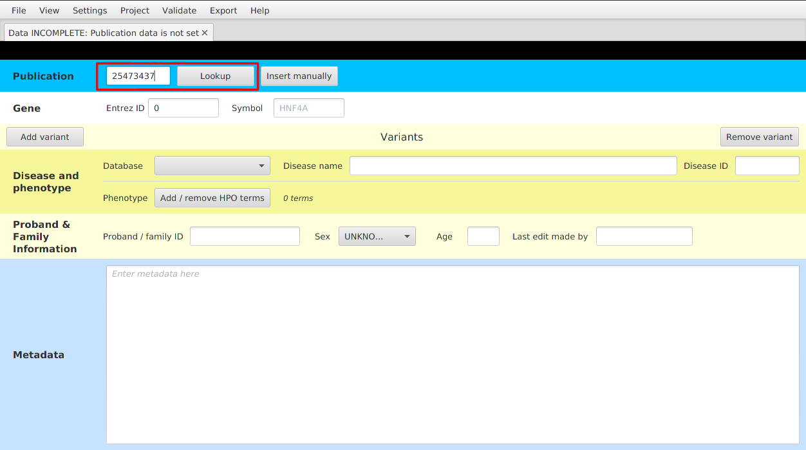
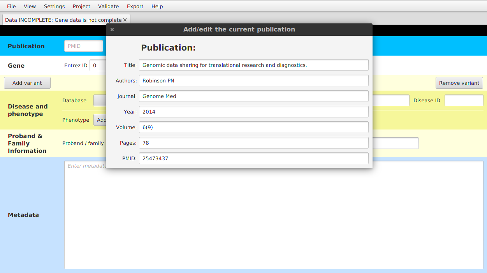
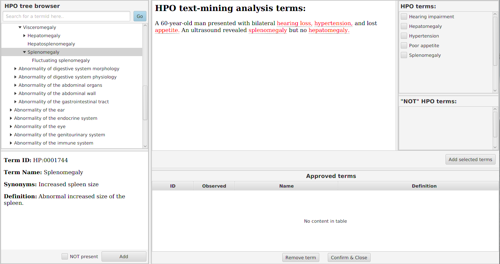

.. highlight:: html

=============
Entering data
=============

.. warning::
  The documentation has not been updated for the `2.*` version yet.

Publication
###########
There are two ways of entering the data regarding the publication which describes the curated case:

1.  *Using PMID* - enter the *PMID* number of the publication and hit the *Lookup* button. Publication details will be fetched from
    PubMed API, resulting in showing PMID and publication title.

2.  *Entering the details manually* - click on the *Insert manually* button and enter all the details into the window
    that appears on the screen.

After setting the publication data, you can modify the data using ``View | Show / edit current publication`` menu item.

Genome build
############
For now, please use build 37 (called either "GRCh37" or "hg19"). Later, we will use the liftover utility of UCSC to add data for build 38.

Target Gene
###########
In presumably almost all cases, we will know the target gene of the variant that has been published. We enter two bits of information:

- Entrez gene ID (e.g. 3172)
- gene symbol (e.g. *HNF4A*)

Note that the autocompletion is available for both fields, so usually entering just the gene symbol should be enough.

Variants
########
Click to *Add variant* button in order to create a new box for variant data. There are several variant types, where we
store different set of variant validation metadata for each type.

Mendelian
---------
Validation metadata important for the *Regulatory mendelian mutations (REMM)* project.

Somatic
-------
Validation metadata for somatic variants.

Splicing
--------
Data regarding splicing for the variants curated in the *Squirls* project.

Structural (Intrachromosomal/Translocation)
-------------------------------------------
The way how we store data for variants stored in format denoted as *symbolic* in the VCF specs. These variants are
usually longer (>100bp) deletions, duplications, inversions, etc.

We store the variants that affect a single chromosome using ``INTRACHROMOSOMAL`` variant type. The variants that affect
multiple chromosomes (translocations/breakends) are stored as ``TRANSCLOCATION`` type.

Chromosome and position
-----------------------
Consult the article you are reading. I have found it helpful to see if the sequence surrounding the variant position is shown somewhere in the article. If this sequence is 20 nucleotides or more, you can use the `BLAT tool of UCSC Genome Browser <https://genome.ucsc.edu/cgi-bin/hgBlat?command=start>`_ to find the corresponding position in the genome. If there are only a few bases, sometimes you can use guesswork to narrow things down enough to find the corresponding place in the genome. For older articles that specify the position of a variant using Genome Build 36 (called either "GRCH36" or "hg18"), you can use the `UCSC Liftover utility <https://genome.ucsc.edu/cgi-bin/hgLiftOver>`_. There are some articles that are of such low quality that it is simply not possible to reliably identify the chromosomal position of the variant. In these cases, the article should be rejected. It may also be worthwhile to consult `dbSNP <https://www.ncbi.nlm.nih.gov/projects/SNP/>`_ or `ClinVar <https://www.ncbi.nlm.nih.gov/clinvar/>`_, since some published pathogenic variants are entered in these databases.

Note that position should be **one-based**, and *not* zero-based.

Reference / Alternative allele
------------------------------
For single-nucleotide variants, *Ref* and *Alt* are simply A,C,G, or T.

For deletions and insertions, please use the VCF format. Here is the `Webpage with the latest details <https://github.com/samtools/hts-specs>`_, but if in doubt please ask Peter. Just to give a simple example:

----------------------------------

  Let us pretend we have a ten base-pair reference sequence on chromosome ``Z``: ::

    ACGTAAGTCA

  Let us imagine that the ``T`` at position 4 is deleted. This results in the sequence: ::

    ACGAAGTCA

  It might seem logical to write simple position=4, ref="T", alt="-". VCF format calls instead for this: ::

    #CHROM POS ID REF ALT (other stuff)
    Z 3 . GT G (other stuff)

  This means that the dinucleotide at position 3-4 is affected and the variant sequence has only a G. For an insertion of a C between the T at position 4 and the A at position 5, we write: ::

    #CHROM POS ID REF ALT (other stuff)
    Z 4 . T TC . (other stuff)

  We will use this convention, which will allow us to check the reference sequence and the position even for deletions, and should allow us a little more possibilities for Q/C-ing the genomic position etc.

----------------------------------

Variant status
--------------

We need to enter information about whether the variant is **heterozygous** or **homozygous**. Note that if the patient has two different heterozygous mutations (i.e., is compound heterozygous), then we enter the second mutation in the second *Variant* box. In all other cases, we just use the first *Variant* box. Also, note that in some cases, the publications state (for an autosomal recessive disease) that *"the second mutation could not be found"*. Also in this case, do not enter anything into the second *Variant* box.

Note that if the first mutation is regulatory and the second mutation is coding (e.g., missense, nonsense, splicing, etc.), then you should use the category *coding* for the second mutation.

Finally, it is a good idea to use the `Mutalyzer <https://mutalyzer.nl/>`_ to check the nomenclature and location of the variants. The Mutalyzer will provide the surrounding genomic sequence for most variants, and this can be used to identify the genomic position of coding mutations using `BLAT <https://genome.ucsc.edu/cgi-bin/hgBlat?command=start>`_. It may also be useful to consult with `ClinVar <https://www.ncbi.nlm.nih.gov/clinvar/>`_ or the public version of HGMD about this.

Variant class
-------------

One of:

1. *promoter* - note that there are no really good definitions of where the promoter is located. Please put anything in the 5UTR in the class 5UTR, even if the effect seems to be on the promoter. Probably anything within 5-10,000 nucleotudes upstream of the transcription start site can be called promoter, but since we will have the numbers, we can do the classification automatically later. For now, I have taken the classification as mentioned in the original publications.
2. *enhancer* - regulatory region that is farther removed from the transcriptional start site than a promoter.
3. *5' UTR*
4. *3' UTR*
5. *microRNAgene* - here we mean any variation that affects the transcript that encodes for a microRNA (note: mutations that affect microRNA binding sites should in general be classified as *3' UTR*).
6. *RNP_RNA* - ribonucleoprotein (RNP) RNA component gene. These include ribosome and snRNP
7. *LINC_RNA* long intergenic non-coding RNA gene
8. *coding* - we only incldue coding mutations if the patient being described was compound heterozygous for a coding mutation and a regulatory mutation

Note that the *5' UTR* DNA sequences often form part of the actual promoter, and in general it is not possible to know if a variant affects the promoter function or the *5' UTR* function (which is of course in the mRNA and can affect the stability of the transcript). If a mutation is located in the *5' UTR*, then please enter *5' UTR* even if the effect is on the promoter. The data base and downstream analysis just has to know about this. In some cases, a mutation may be both *5' UTR* and promoter etc. Please enter the category that seems most relevant. We will automatically generate these annotations using ``jannovar`` anyway, so even variants with multiple categories will be correctly classified.

Note again that the category *coding* should only be used for the *second* mutation in compound heterozygous cases. At some point we may want to consider adding other classes, but none of the old data will be affected by a new class (e.g., silencer).

Disease data
############
Set the database (please use the OMIM id if at all possible). For OMIM, use the phenotype id, and not the gene id.

1. *Database*: one of OMIM or ORPHANET (use drop-down menu)
2. *Disease name*: please use a lower-case form of the canonical name, i.e., do not include all of the synonyms in upper-case letters.
3. *Database ID*: for OMIM; this will be a number like 614321

Phenotype data (HPO)
####################
To enter or to modify the HPO data, you want and click on the *Add / remove HPO terms* button. Note that if you find
you do not have enough, you can add additional terms with this button too.

A new window will be opened with *HPO tree browser* on the left side, *Text-mining analysis* on the right side and with
table of *Approved terms* on the bottom-right side.

You should start typing name of the phenotypic trait into the text field above from the ontology tree. The text field
has an autocompletion feature and helps you to identify the correct *HPO term label*. After completion of the label,
click on the *Go* button to navigate to the term's position in the ontology tree.

Then, you may want to look around the term in the ontology tree a bit and then approve the term's presence by hitting
*Add* button at the bottom. The term will appear in the *Approved terms* table.

Text mining
-----------

In case you're curating variants from a publication that contains a clinical description of the proband's condition,
*text mining* comes to help. To identify candidate HPO terms in a clinical description text, paste the text into the
*Text-mining analysis* field.

Try the text-mining using e.g. the following toy example::

  A 60-year-old man presented with bilateral hearing loss, hypertension, and lost appetite.
  An ultrasound revealed splenomegaly but no hepatomegaly.

Five HPO terms are picked up from the toy example. HPO term definition appears upon hovering with mouse upon the
highlighted text. Clicking on the text will navigate you to the term definition within the ontology hierarchy (left panel).
We recommend to read the text, approve the relevant terms on the right panel, and approving the mined terms by clicking
on *Add selected terms* button.

.. note::
  The previously used text-mining service was also able to identify *not* terms (e.g. no hepatomegaly). Unfortunately,
  the current service does not support this feature.

Proband & Family Information
############################
The ID (patient/family identifier) is a free-text string that represents the ID used to designate the affected individual or family in the original paper. For instance, ``family 3``. Note that we usually include all of the pathogenic variant in a given paper, but if little clinical data is given, and the phenotype is identical for two families, then it is OK to enter ``family 3 and family 7``, say.

Metadata
########
Many of the individual papers about disease-causing variants have a lot of interesting additional information that is more or less heterogeneous. We would like to capture the most salient points in a free text that will be displayed on the planned website. For instance, here is an example ``Metadata``: ::

  The mutation is located in a 400-bp sequence located 25 kb downstream of PTF1A (the gene
  for pancreas-specific transcription factor 1a). This region acts as a developmental enhancer
  of PTF1A and that the mutations abolish enhancer activity. The mutation was shown to abolish
  binding of FOXA2 (Supplementary Figure 8 of Wheedon et al., 2014).

