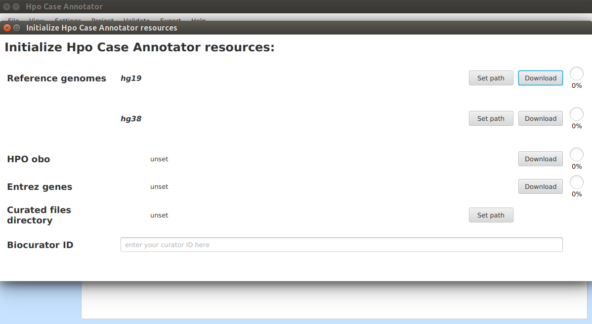

========================================================
Getting the app for your operating system & installation
========================================================

Getting the app
---------------

Windows
#######

There is a prebuilt *exe* file for Windows users available at `Hpo Case Annotator releases <https://github.com/monarch-initiative/HpoCaseAnnotator/releases>`_ page. However, you need to have Java Runtime Environment installed on the machine. Otherwise, you will be prompted to download one.

Mac OSX
#######

**Use prebuilt app**

Mac users should use the prebuilt App `HpoCaseAnnotator-1.0.6-uber.jar` available at `Hpo Case Annotator releases <https://github.com/monarch-initiative/HpoCaseAnnotator/releases>`_ page. The `JAR` file is executed by double-clicking with mouse. Another way of launching the app is to use the Terminal::

  $ java -jar HpoCaseAnnotator-1.0.6-uber.jar

**Build from sources**

It is also possible to build the *Hpo Case Annotator* from source code using Maven::

  $ git clone https://github.com/monarch-initiative/HpoCaseAnnotator.git
  cd HpoCaseAnnotator
  mvn package

After successful build process the ``HpoCaseAnnotator-Gui-1.0.6-uber.jar`` will be present in ``hpo-case-annotator-gui/target`` directory.

Linux
#####
Linux users should download the same prebuilt ``HpoCaseAnnotator-Gui-1.0.6-uber.jar`` file as the Mac users or build the app from source code using Maven

Initial setup
-------------

After a successful startup the dialog window will be opened:

.. image:: img/hca_welcome.png

Note, that *not* all the functionality is enabled after the first startup, since there are some resources that need to be downloaded first. Click on ``Settings | Set resources`` to start setting up the app.

A new dialog window will be opened:

Reference genome
################
*Hpo Case Annotator* needs access to the sequence of the reference genome in order to e.g. check whether the wildtype sequence entered for each variant matches the corresponding genomic position. *Hpo Case Annotator* is able to download and pre-process the reference genome or you can provide the FASTA file yourself.

Currently, **GRCh37 (hg19)** and **GRCh38 (hg38)** genome assemblies are supported.

- **Download and pre-process the reference genome sequences automatically**

In order to download the reference genome click on the *Download* buttons of individual genome assemblies. Each assembly file has roughly 1 GB and the download process may take up to 20 minutes depending on the speed of your internet connection. After successful download, sequences of all the chromosomes will be concatenated into a single FASTA file and index will be created automatically using ``HTS-JDK`` library.

- **Provide FASTA file**

You do not have to download the reference genome files if there are already some present in your system. Use **Set path** buttons to set paths to local FASTA files. Corresponding index (\*.fai) files should be present in the same directory.

This is all we need for the genomic position Q/C routines.

HPO obo
#######
The app will automatically download the newest version of *Human Phenotype Ontology* (HPO) in ``OBO`` format, the file has ~5 MB. This needs to be done once (and can be updated as necessary). We download a copy of the OBO file so that the App can autocomplete the HPO terms names and labels.

Entrez genes
############
The app will also download information regarding genes. This also a one-time operation and after the download autocompletion of gene symbols and IDs will be available.

Curated files directory
#######################
Each curated case is stored as a file in ``XML`` format. Here we set path to a directory where the XML files created in a single project are stored.

Biocurator ID
#############
Here provide your biocurator ID.

All of the resources are required to be downloaded just once and after these steps the app is fully prepared for work.

.. image:: img/hca_resources_finished.png

