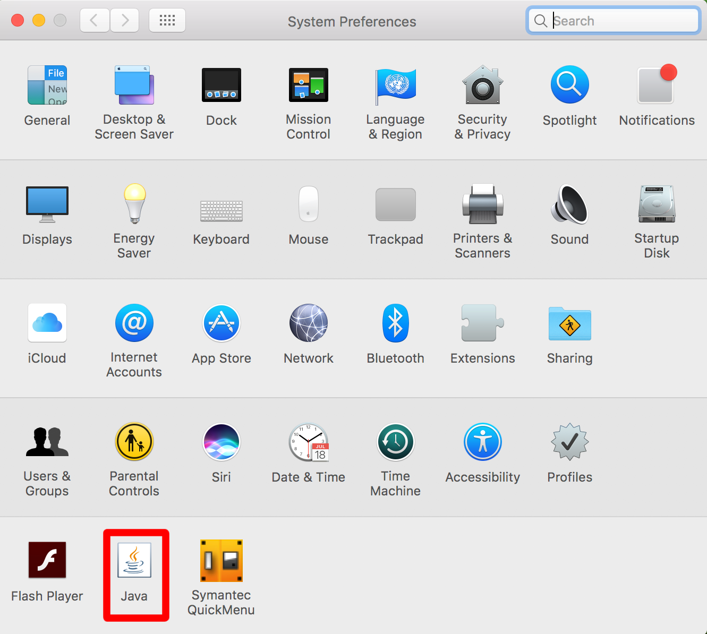
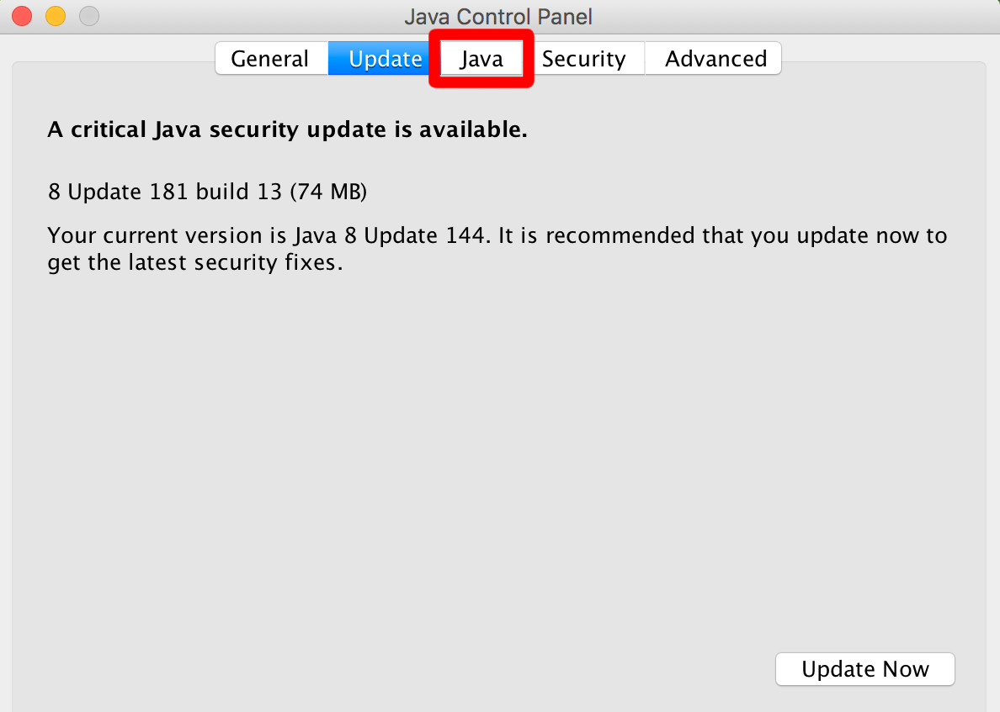
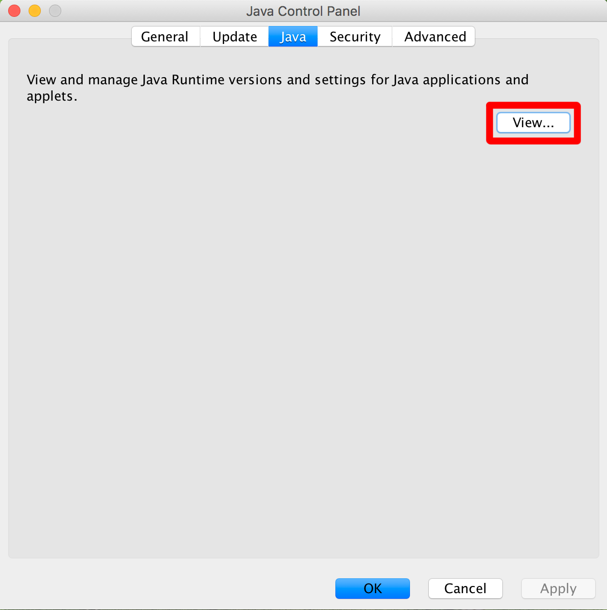
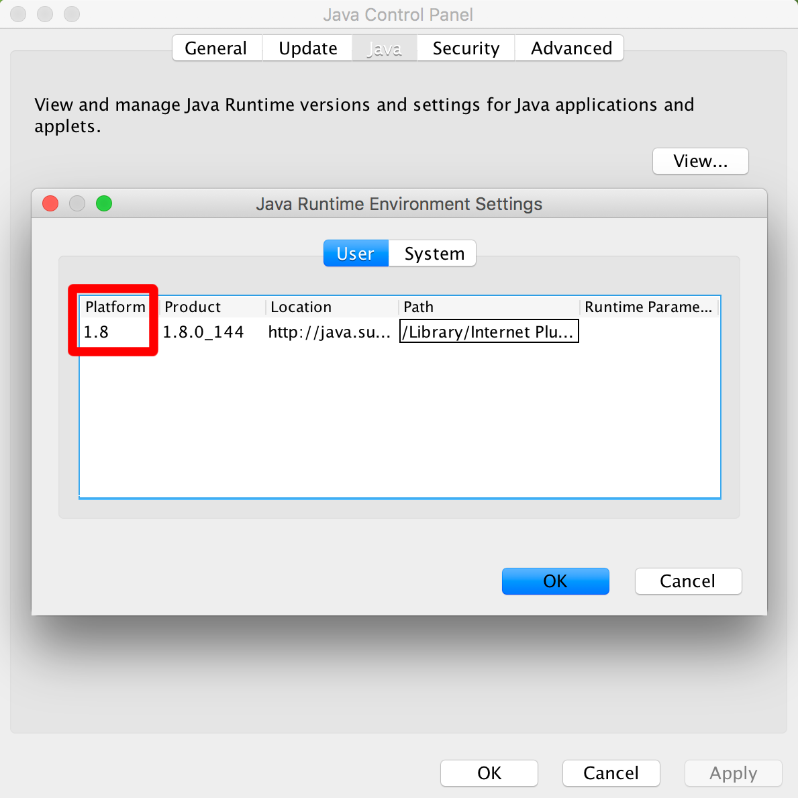
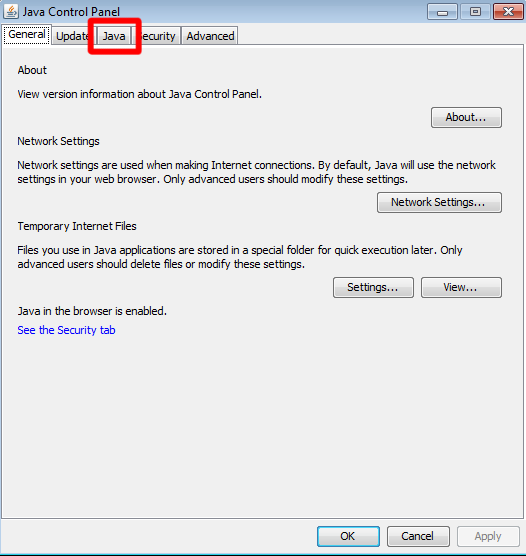
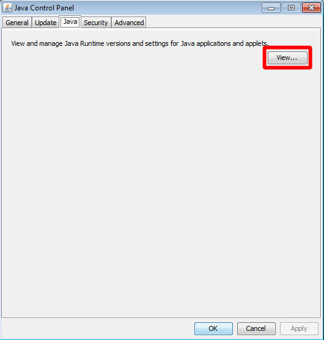
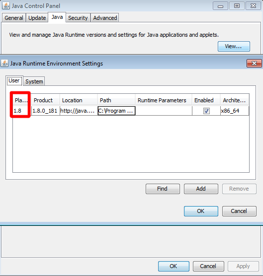

.. _rstrequirements:

============
Requirements
============

*Hpo Case Annotator* is a Java app and it requires **Java 17** or better to be installed in the environment.
This page describes steps required to check which version of Java (if any) is installed on your *Mac*, *Linux*
or *Windows* machine.

Mac OSX
-------

Open the **System preferences** and click on Java.

Select the **Java** tab at the top of the window

Click on the **View** button.

You should see `17` or better (instead of `1.8`) in the *Platform* column of the table.

Linux
-----

You can determine what version of **Java** you have on your computer by running ``java -version`` in your Terminal: ::

  $ java -version
  openjdk version "17" 2021-09-14
  OpenJDK Runtime Environment (build 17+35-2724)
  OpenJDK 64-Bit Server VM (build 17+35-2724, mixed mode, sharing)

Windows
-------
Open **Java Control Panel** and select the **Java** tab at the top of the window.

Click on the **View** button.

You should see `17` or better (instead of `1.8`) the *Platform* column of the table.

Having Java set up, let's move to the next step - setting up *HpoCaseAnnotator* on your machine.
