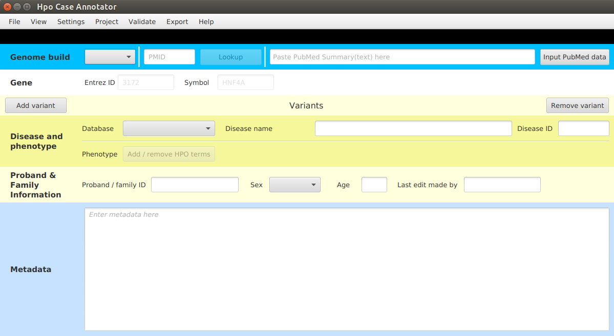
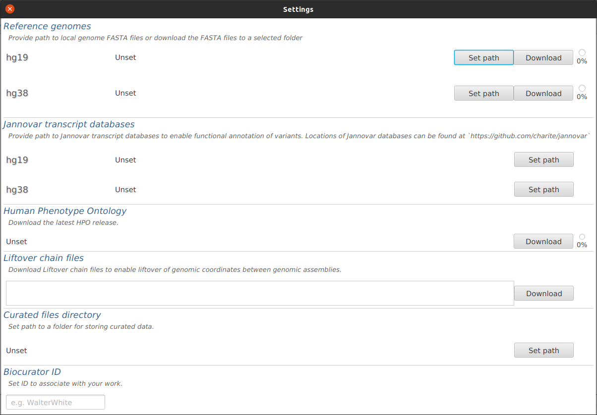
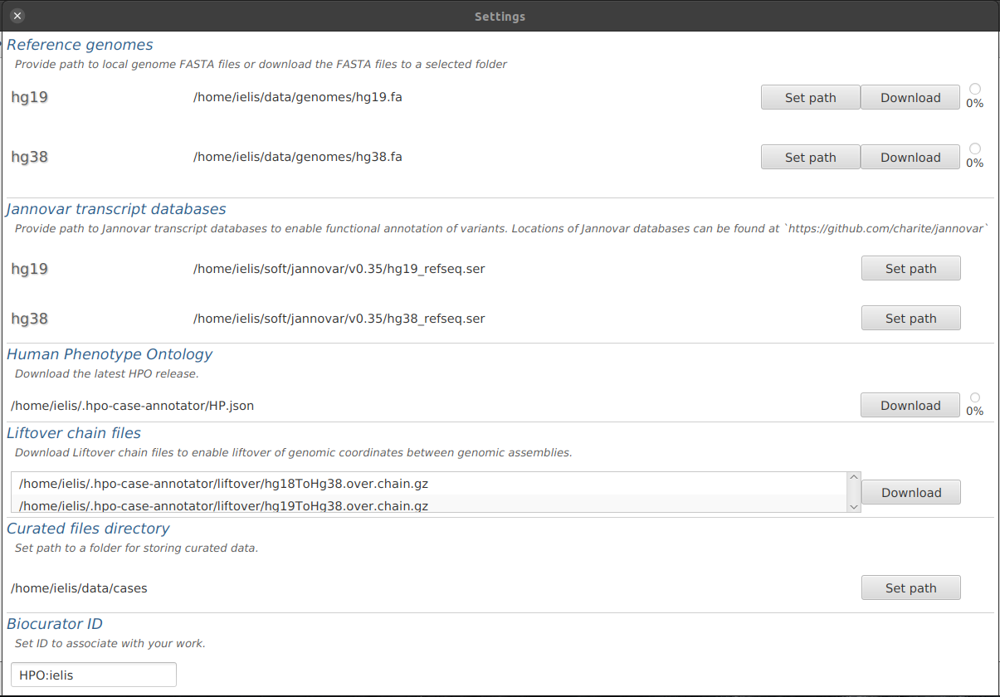

.. _rstsetup:

=====
Setup
=====

This document will guide you through setting up *HpoCaseAnnotator* on your machine. The setup consists of two steps:

1. getting the app (prebuilt archive or building from sources)
2. setting up the resources

Get HpoCaseAnnotator
--------------------

Prebuilt app
~~~~~~~~~~~~

Most users (Mac, Linux, Windows) should download the distribution ZIP archive available at
`HpoCaseAnnotator releases <https://github.com/monarch-initiative/HpoCaseAnnotator/releases>`_.
Make sure you download the ZIP for your platform and unpack the archive.

Build from sources
~~~~~~~~~~~~~~~~~~

*HpoCaseAnnotator* can also be built from sources (Mac and Linux users).

First, we clone the repo from GitHub, and then use the amazing `Maven wrapper <https://maven.apache.org/wrapper/>`_
to build the app::

  $ git clone https://github.com/monarch-initiative/HpoCaseAnnotator.git
  $ cd HpoCaseAnnotator
  $ ./mvnw -Prelease package

.. note::
  The build requires a working internet connection for downloading required libraries and Java Development Kit (JDK) 17 or better.

The build creates the distribution ZIP archive in the ``hpo-case-annotator-app/target`` folder.

Launch
~~~~~~

*HpoCaseAnnotator* is started by double-clicking on a launcher script that is bundled in the distribution ZIP.
The app ships with three launchers, one script per *Mac*, *Linux* and *Windows* platforms:

* **Mac** - open Finder and double-click on ``launch.command``
* **Linux** - open file browser and double-click on ``launch.sh``
* **Windows** - open Explorer and double-click on ``launch.bat``

.. note::
  You need to have Java Runtime Environment (JRE) 17 or better on your machine. See :ref:`rstrequirements` section
  for more info.

The app window will appear shortly after double-click.

Setup
-----

Note, that *not* all the functionality is enabled after the first startup;
the status bar in the bottom part of the screen indicates that e.g. path to HPO file is unset.

Go to ``File | Settings`` as directed - a new dialog window is opened:

Note that most of the resources are *Unset* or empty, we will fill the fields shortly.

Reference genomes
~~~~~~~~~~~~~~~~~

*HpoCaseAnnotator* needs access to the sequence of the reference genome to e.g. check if the wildtype sequence
entered for each variant matches the corresponding genomic position.
You can provide a local FASTA file yourself (`Set path` button) or *HpoCaseAnnotator* can download and pre-process
the reference genome automatically (`Download` button).

Currently, **GRCh37 (hg19)** and **GRCh38 (hg38)** genome assemblies are supported. This is all we need
for the Q/C routines.

.. note::
	The reference genome files have ~4GB each. Handle with care.

Jannovar transcript databases
~~~~~~~~~~~~~~~~~~~~~~~~~~~~~

*HpoCaseAnnotator* uses Jannovar to perform functional annotation of variants with respect to genes and transcripts.
Therefore, the app needs to know the location of Jannovar transcript databases. As of now, the databases
must be downloaded manually. The download links are in `Jannovar code repository <https://github.com/charite/jannovar>`_.

Download databases for `H. sapiens` to a location of your choice. Both *ENSEMBL* or *RefSeq* will work fine
(although only one can be used at the time). After download, click on `Set path` buttons to set paths.

Human Phenotype Ontology
~~~~~~~~~~~~~~~~~~~~~~~~

*HpoCaseAnnotator* can download the latest version of *Human Phenotype Ontology* (HPO) in `JSON` format.
The `JSON` file (~25 MB) is downloaded into *HpoCaseAnnotator* data folder which is located in your home directory.
The download needs to be done once (and can be updated as necessary).

Click on `Download` button to download the `JSON` file.

Liftover chain files
~~~~~~~~~~~~~~~~~~~~

*HpoCaseAnnotator* needs Liftover chain files to provide the liftover functionality. The chains for converting
genomic positions from *hg18* or *hg19* to *hg38* (<1MB) are downloaded into *HpoCaseAnnotator* data folder
after clicking on `Download` button.

Curated files directory
~~~~~~~~~~~~~~~~~~~~~~~

Each curated case is stored as a `JSON` file. Here we set path to a directory where the `JSON` files are stored by default.
We recommend using a directory per project.

Biocurator ID
~~~~~~~~~~~~~

Here provide your biocurator ID.

----

This setup and the resource download is done only once. And after these steps, the `Settings` dialog can be closed
and *HpoCaseAnnotator* is fully prepared for work.

